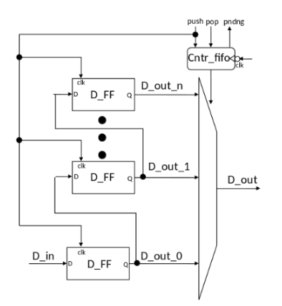
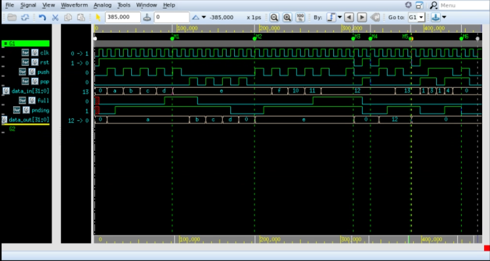

# VeriQuiz1 diseño y verificacion de una FIFO

Jeremy Cordoba, Jesus Rojas
## 1. Desarrollo

### 1.1 Modulo "Registro"

Es un simple flip_flop parametrizable por medio de `N`, su implementacion es a traves de un always secuencial que reacciona al posedge del clock, en el momento que recibe un posedge, coloca la entrada en la salida.

### 1. Encabezado del modulo

```SystemVerilog
module Registro #( parameter N = 32)
    (
    input  logic         rst_i, 
    input  logic         push_i, //Entrada que al ser verdadera entoncer manda el valor a la salida
    input  logic [N-1:0] data_i,
    output logic [N-1:0] data_o
    );
```

### 2. Parametros
- `N`: indica el ancho del dato del registro.

### 3. Entradas y salidas:

- `rst_i`: reset del registro
- `push_i`: valor que guarda el valor de entrada en el registro
- `data_i`: dato que se va a guardar
- `data_o`: salida que reflejara la entrada en el momento que se guarde


### 1.2 Modulo "Registros"

Modulo que mediante un generate toma el modulo `registros` y conecta varios entre si, precisamente conecta la salida del anterior con la entrada del siguiente y asi sucesivamente

### 1. Encabezado del modulo

```SystemVerilog
module Registros#( parameter WIDTH = 32, DEPTH = 4 ) //Derecha ancho del vector
                                                      //Izquierda Tama?o de los registros 
    (
    input  logic                            rst_i,
    input  logic                            push_i,
    input  logic [WIDTH - 1:0]              data_i,  // Dato que entra al primer flip flop  
      
    output logic [DEPTH - 1:0][WIDTH - 1:0] data_o   //Salida de este modulo.
    );
```

### 2. Parametros
- `DEPTH`: indica la cantidad de registros
- `WIDTH`: indica el ancho del dato del registro

### 3. Entradas y salidas:

- `rst_i`: reset del registro
- `push_i`: valor que guarda el valor de entrada en el registro
- `data_i`: dato que se va a guardar
- `data_o`: cadena de registros.

### 1.3 Modulo "control_fifo"

Diseñado mediante una maquina de estados, cada combinacion de entrada de push y pop, genera una salida especifica que controla el comportamiento de los registros y el multiplexor

### 1. Encabezado del modulo

```SystemVerilog
module control_fifo #(parameter WIDTH = 32, DEPTH = 16)
    (
    input  logic                            clk_i,
    input  logic                            rst_i,
    input  logic                            push_i,
    input logic                             pop_i,
    
    output logic                            full_o,
    output logic                            pnding_o,
    output logic [$clog2(DEPTH) - 1:0]      selmux_o,
    output logic                            rst_reg_o
    
    );
```

### 2. Parametros
- `DEPTH`: indica la cantidad de registros
- `WIDTH`: indica el ancho del dato del registro

### 3. Entradas y salidas:

- `clk_i`: reloj
- `rst_i`: reset del registro
- `push_i`: valor que guarda el valor de entrada en el registro
- `pop_i`: señal que saca los datos de los registros
- `full_o`: señal que indica que ya los registros estan llenos
- `pnding_o`: indica si hay datos que pueden ser procesados, si es 0 los registros estan vacios.
- `selmux_o`: selecciona el valor de los registros.
- `rst_reg_o`: es 1 cuando se hace un pop y ya el contador es 0 por lo que reinicia todos los registros dejandolos vacios por completo.


### 1.4 Modulo "fifo_top"

Modulo que conecta todos los registros con el multiplexor que se establecio como un solo assign que guarda el valor de la salida segun un indice dado por el módulo de contro

### 1. Encabezado del modulo

```SystemVerilog
module fifo_top #(parameter WIDTH = 32, DEPTH = 4)
    (
    input  logic                            clk_i,  
    input  logic                            rst_i,  
    input  logic                            push_i, 
    input  logic [WIDTH - 1:0]              data_i,  //Dato de entrada que se le hara push
    input  logic                            pop_i,
    
    output logic [WIDTH - 1:0]              data_o,  //Dato de salida despues de hacer pop
    output logic                            full_o,  //Señal de que los registros ya estan llenos 
    output logic                            pnding_o //Señal de que hace falta agregar datos

);
```

### 2. Parametros
- `DEPTH`: indica la cantidad de registros
- `WIDTH`: indica el ancho del dato del registro

### 3. Entradas y salidas:

- `clk_i`: reloj
- `rst_i`: reset del registro
- `push_i`: valor que guarda el valor de entrada en el registro
- `pop_i`: señal que saca los datos de los registros
- `data_i`: dato que entra a los registros
- `data_o`: dato que sale del mux
- `full_o`: señal que indica que ya los registros estan llenos
- `pnding_o`: indica si hay datos que pueden ser procesados, si es 0 los registros estan vacios.

### 4. Criterio de diseño
El diseño de la fifo esta basada en el siguiente diagrama de bloques.



### 5. Testbench

El testbench de la FIFO se encuentra en la dirección `/Testbench/test_registros.sv`. Para la verificación de la FIFO se realizaron las siguientes pruebas:

- LLenado
- Vaciado
- Push cuando ya está lleno
- Reset cuando ya está lleno
- Pop cuando está vacía
- Reset cuando está vacía
- LLenado por la mitad
- Reset cuando está por la mitad
- Push y pop aleatorios
- Push y pop al mismo tiempo

  En la siguiente imagen se puede observar el Waveform ejecutado en  `verdi`. En este se muestran las señales más importantes de la FIFO. Se agregaron varias marcas de tiempo que indican cada una de las pruebas mencionadas anteriormente.



  En primer lugar se llenan los registros, lo cual toma el tiempo que marca el cursor (M1), en este se puede ver como la señal de `full` se activa, con cuatro pulsos de `push` dado que el `DEPTH` de los registros se inicializó en un valor de 4.

  Luego, se procede con el vaciado ( entre los cursores M1 y M2 ) en este se puede observar como la salida `data_out` va cambiando con cada pulso de pop, hasta que la señal de `pnding` baja a cero, lo que indica que ya está vacía.

  Seguido se vuelve a llenar los registros, una vez la señal de `full` se activa, se realiza otro pulso de `push` para el caso de prueba de push estando lleno, observando que salida efectivamente no cambia. Justo de después de la marca M3 se aplica un `reset` estando la fifo llena y luego un `pop` estando la fifo vacía, con lo que se verifica que el dato de salida sigue con un valor de 0. Luego en el tiempo que marca M4 se aplica un `reset` a la fifo vacía. Seguido de esto se vuelve a llenar, pero esta vez a la mitad ( que serían dos datos ), y se aplica el `reset`. Despues de esto en M5 se realizan `push` y `pop` aleatorios, con datos ingresados de manera aleatoria igualmente, observando que el dato de salida se muestra correctamente.

  Por último, en M6 se aplica un `push` y `pop` al mismo tiempo y observando el dato se salida se compruebo que cumple con lo diseñado, es decir que el puntero no cambia.

  

  
  


